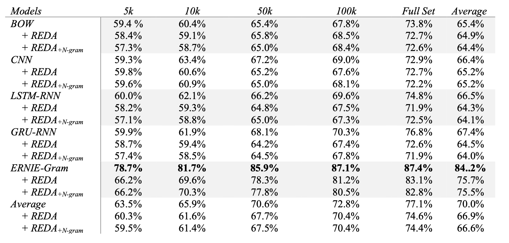
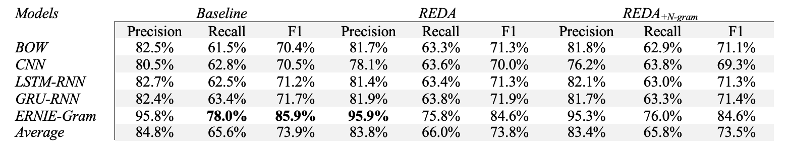

The source code and data for my paper titled [Linguistic Knowledge in Data Augmentation for Natural Language Processing: An Example on Chinese Question Matching](https://arxiv.org/abs/2111.14709). The [ReduplicatingTheStudy folder](https://github.com/jaaack-wang/linguistic-knowledge-in-DA-for-NLP/tree/main/ReduplicatingTheStudy) provides details of how to reproduce the results of this paper as well as the experimental results for fitting the classification models. 

## Description 

The paper examines the role of linguistic knowledge in data augmentation for natural language processing (NLP). More concretely, I adapted and rewrote the widely used Esay Data Augmentation program ([program](https://github.com/jasonwei20/eda_nlp), [paper](https://arxiv.org/abs/1901.11196)) and created two revised verisons that augment Chinese text by five simple text editing operations with or without a n-gram language model. The experiments were run on [LCQMC](http://icrc.hitsz.edu.cn/info/1037/1146.htm) (Large-scale Chinese Question Matching Corpus) with the original train set of varying size as well as the corresponding augmented train sets for a binary Chinese question matching task utilizing five neural classification models (BOW, CNN, LSTM-RNN, GRU-RNN, ERNIE-Gram). 

The results show that models trained on the augmented train sets were outperformed by those trained without augmentation, contrary to [the EDA authors' findings](https://arxiv.org/abs/1901.11196) on 5 much simpler sentiment-related and text type classification tasks. Moreover, the revised EDA program enhanced with a n-gram language model did not lead to better trained classifications, due to the inability of the underlying text editing operations to make paraphrastic augmented texts. As question matching, or text matching, is a more fundamental task for NLP, and a more difficult one (it compares a pair of texts, instead of one, to predict a label), this study shows the limitation of random text editing perturbations as a data augmentation approach for NLP. Instead, the paper proposes a possible paradigm shift for data augmentation: instead of augmenting existing data, it may be worth trying to augment synthetic data. 


## A quick look at the results  

The table below shows the test set accuracies of the five classification models trained on the three types of train sets of varying size. REDA: Revised EDA program.  is the REDA program combined with a n-gram language model. 

 


The table below shows the average precision, recall, and f1 scores for the five classification models on the three types of train sets.

 


## Built programs

Below are three programs created in this study. For the classification models, I reused the ones already built by Baidu's paddlenlp team with a few revisions for its training and predicting scripts. Please refer to the [scripts folder](https://github.com/jaaack-wang/linguistic-knowledge-in-DA-for-NLP/tree/main/scripts) to find out more.

- REDA: Revised Esay Data Augmentation, currently for Chinese, but easy to adapt. It works by five text editing operations, i.e., Synonym Replacement (SR), Random Swap (RS), Random Insertion (RI), and Random Deletion (RD), and Random Mix (RM). RM is a newly created operation that randomly selects 2-4 of the other four operations to produce novel texts. The REDA program also solves the problem of EDA program not depulicating the outputs. [Code](https://github.com/jaaack-wang/linguistic-knowledge-in-DA-for-NLP/blob/main/scripts/reda.py).
- : the REDA program combined with a n-gram language model that select the most likely augmented texts as the outputs, which turn out to be more readable and grammatical. Nevertheless, due to the simpilicity of the REDA program, adding probabilisic contrains does not make the augmented texts paraphrastic. [Code](https://github.com/jaaack-wang/linguistic-knowledge-in-DA-for-NLP/blob/main/scripts/redaNgramLm.py)
- N-gram language model: [Code](https://github.com/jaaack-wang/linguistic-knowledge-in-DA-for-NLP/blob/main/scripts/ngramLM.py)


## Citation

```cmd
@misc{wang2021linguistic,
      title={Linguistic Knowledge in Data Augmentation for Natural Language Processing: An Example on Chinese Question Matching}, 
      author={Zhengxiang Wang},
      year={2021},
      eprint={2111.14709},
      archivePrefix={arXiv},
      primaryClass={cs.CL}
}
```
