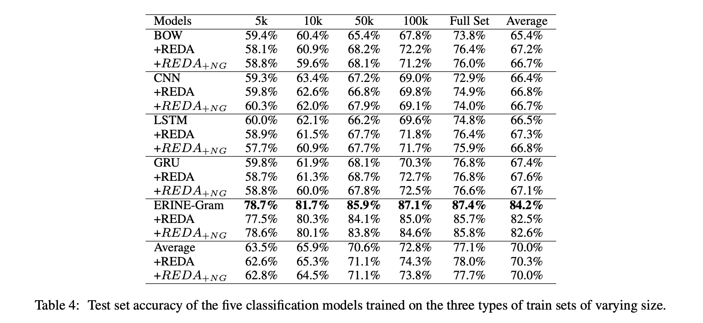
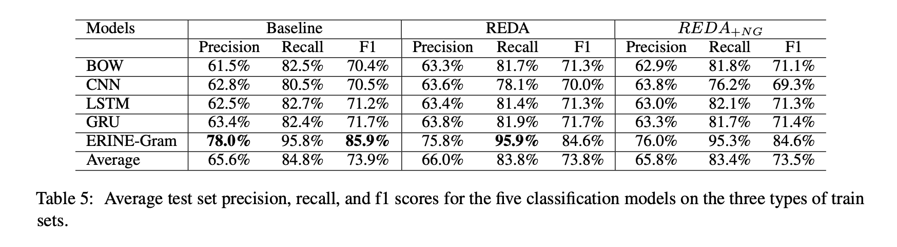
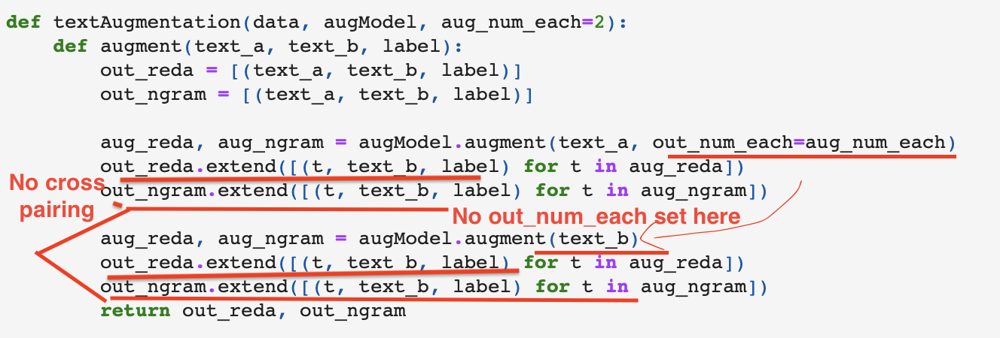

The source code, data, and results for my paper titled [Linguistic Knowledge in Data Augmentation for Natural Language Processing: An Example on Chinese Question Matching](https://arxiv.org/abs/2111.14709). The [ReduplicatingTheStudy folder](https://github.com/jaaack-wang/linguistic-knowledge-in-DA-for-NLP/tree/main/ReduplicatingTheStudy) provides details on how to reproduce the results of this paper. Please let me know if you have any problems reproducing the results.

If you are interested in the ins and outs of text matching, please check my [text-matching-explained](https://github.com/jaaack-wang/text-matching-explained) repository. If you are interested in text augmentation, you are welcome to visit my [text-augmentation-techniques](https://github.com/jaaack-wang/text-augmentation-techniques) repository to find out more. 

Structure of this repository: 
- [1. Description](#1)
- [2. A quick look at the results](#2)
- [3. Built programs](#3)
- [4. Updates](#4)
- [5. Citation](#5)


<a name='1'></a>
## Description 

The paper examines the role of linguistic knowledge in data augmentation for natural language processing (NLP). More concretely, I adapted and rewrote the widely used Esay Data Augmentation program ([program](https://github.com/jasonwei20/eda_nlp), [paper](https://arxiv.org/abs/1901.11196)) and created two verisons that augment Chinese text by five simple text editing operations with or without a n-gram language model. The experiments were run on [LCQMC](http://icrc.hitsz.edu.cn/info/1037/1146.htm) (Large-scale Chinese Question Matching Corpus) with the original train set of varying size as well as the corresponding augmented train sets for a binary Chinese question matching task utilizing five neural classification models (BOW, CNN, LSTM-RNN, GRU-RNN, ERNIE-Gram). 

The basic findings are twofold:
- The revised EDA program enhanced with a n-gram language model did not lead to better test set classification results in terms of accuracy, precision, recall, and F1 scores. This is also true even when the five text editing operations are applied and compared separately for the two revised programs (as shown in the ablation study). This means that adding probabilistic linguistic knowledge as constrains is not very useful, although doing so does lead to more readable and higher-quality augmented texts.
- Unlike [the EDA authors' findings](https://arxiv.org/abs/1901.11196) on 5 much simpler sentiment-related and text type classification tasks, this study did not find general performance gains across train sets of varying sizes after the five text editing operations or any one of it were applied. Instead, the classification models always need to see sufficient amounts of traning examples (e.g., at least 50k, or at least 100k) so that they can mediate the negative impact of false matching augmented text pairs and generalize better. This shows a limitation of random text editing perturbations used a DA approach, especially for text matching, which is more sensitive to and subject to some tiny semantic changes caused by text augmentation.  


<a name='2'></a>
## A quick look at the results  

The table below shows the test set accuracies of the five classification models trained on the three types of train sets of varying size. REDA: Revised EDA program.  is the REDA program combined with a n-gram language model. 
 
 <p align='center'>
 
</p>

The table below shows the average precision, recall, and f1 scores for the five classification models on the three types of train sets.

<p align='center'>
 
</p>

The figure below shows the average test set accuracy scores of the five classification models under different conditions (i.e., text editing type, training data size) for the three types of train sets. The sixth plot averages the statistics of the previous five plots. 

<p align='center'>
 
</p>

<a name='3'></a>
## Built programs

Below are three programs created in this study. For the classification models, I reused the ones already built by Baidu's paddlenlp team with a few revisions for its training and predicting scripts. Please refer to the [scripts folder](https://github.com/jaaack-wang/linguistic-knowledge-in-DA-for-NLP/tree/main/scripts) to find out more.

- REDA: Revised Esay Data Augmentation, currently for Chinese, but easy to adapt. It works by five text editing operations, i.e., Synonym Replacement (SR), Random Swap (RS), Random Insertion (RI), and Random Deletion (RD), and Random Mix (RM). RM is a newly created operation that randomly selects 2-4 of the other four operations to produce novel texts. The REDA program also solves the program of EDA program not depulicating the outputs. [Code](https://github.com/jaaack-wang/linguistic-knowledge-in-DA-for-NLP/blob/main/scripts/reda.py).
- : the REDA program combined with a n-gram language model that select the most likely augmented texts as the outputs, which turn out to be effective in making the augmented texts more readable and grammatical. Nevertheless, due to the simpilicity of the REDA program, adding probabilisic contrain does not make the augmented texts paraphrastic. [Code](https://github.com/jaaack-wang/linguistic-knowledge-in-DA-for-NLP/blob/main/scripts/redaNgramLm.py)
- N-gram language model: [Code](https://github.com/jaaack-wang/linguistic-knowledge-in-DA-for-NLP/blob/main/scripts/ngramLM.py)

<a name='4'></a>
## Updates

### Jan 26, 2022: New tests on English and other tasks!

I run additional tests on English Question matching and other classification tasks (currently, Chinese sentiment analysis). The test code, data, and results can be found in the newly added folders that start with "Tests_On_...". The current results on English Question matching appear to support the basic findings made in my paper! That is, random text editing operation is not a reliable and generally applicable means of text augmentation, especially when augmenting texts for text matching classification task. There is a need of sufficiently large number of training examples in order to allow the augmented train sets to improve the final performances on the test set, which is not practical because most of the time we do text augmentation when the data set is small. If that is the case, we will be better off just using transfer learning, instead of text augmentation.

<hr>

### Jan 8, 2022: Thoughts on preprocessing

In my paper, I said, the "REDA program does not preprocess the input text by removing punctuations or by introducing stop words" because I "did not find this type of preprocessing helpful and necessary in general or makes sense for the basic idea of random text editing" operations, which is very true for Chinese. However, for languages like English where the case of letters (e.g., upper or lower) can affect machines finding synonyms, there may be a need to lower the words before searching for synonyms. Other than that, preprocessing should be avoided for **RANDOM** text editing operations.


<hr>

### Dec 17, 2021: Correction Statement

In the first draft of the paper, there were two unintentional errors I made when augmenting train sets as can be seen below:

- First, I forgot to pass a parameter called out_num_each when calling the `augModel.augment` function in the second time. This mistake should not be very harmful. 
-  Second, I did not do cross pairing at all when augmenting texts as described in my paper! This is a very severe mistake because not doing cross pairing will make one side of the texts always being paired with their augmented texts. When the original labels are 0s (non-matching), but the augmented texts are supposed to match with the original texts, that creates a great deal of false non-matching augmented text pairs. In other words, not doing cross pairing is likely to produce significantly more label-changing examples, which in the first draft were mistakenly analyzed as the limitations of random text editing operations for question matching task. **Therefore, when reading and citing the paper, please refer to the second version and discard the first one!** The second draft also comes with an ablation study, which is absent in the first draft.

<p align='center'>
 
</p>


<a name='5'></a>
## Citation

```text
@misc{wang2021linguistic,
      title={Linguistic Knowledge in Data Augmentation for Natural Language Processing: An Example on Chinese Question Matching}, 
      author={Zhengxiang Wang},
      year={2021},
      eprint={2111.14709},
      archivePrefix={arXiv},
      primaryClass={cs.CL}
}
```


