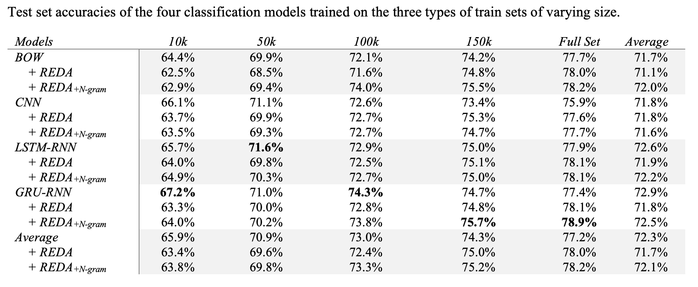
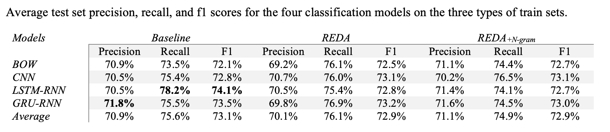

## Description

This folder stores code, data, and experimental results for additional tests on English question matching where four supervised classification models (`ERNIE-Gram` was excluded here because it was expensive to train and may not reveal anything interesting) are trained on three types of train sets of varying sizes: un-augmented train sets, train sets augmented by the `reda` program, and train sets augmented by the `reda` program combined with a `ngram` model. 

The [Quora Question Pairs Dataset](https://quoradata.quora.com/First-Quora-Dataset-Release-Question-Pairs) is used here for text augmentation and model training. The `get_data.ipynb` file provides how the dataset is split into three parts (train, dev, and test) and how an English vocab is built out of the train set using the `TextVectorizer` class method inside the `utils.py`. The `Ngrams_Aug_Texts` folder provides details on how the n-gram language model for English is trained and how the augmented train sets are built. 

## Basic statistics about the dataset

- For the train, dev, and test set.

| Dataset | Total | Matched| Mismatched | 
| :---: | :---: | :---: | :---: |
| Train | 260,000 | 130,000 | 130,000 | 
| Dev | 20,000 | 10,000 | 10,000 | 
| Test | 18,526 | 9,263 | 9,263 | 

- For the augmented train sets.

| Base | 10k | 50k| 100k| 150k| full (260k)|
| :---: | :---: | :---: | :---: | :---: | :---: |
| + REDA | 148,341 | 543,066 | 1,086,063 | 1,629,178 | 2,823,733 |
| + REDA + Ngram | 141,604 | 512,176 | 1,023,777 | 1,536,285 | 2,662,639 |

## Results

I only trained four classifcation models (BoW, CNN, LSTM-RNN, GRU-RNN), using the same models and same set of hyperparameters when training them. ERNIE-Ggram model or other pre-trained models are not trained because it is expensive to do and it seems clear that they will not affect how the final results will be interpreted. `Training.ipynb` is a record of training these four models (on Baidu Machine Learning Codelab). The full statistics are in the `ModelPerformances.xlsx` file.

- Test set accuracies of the four classification models trained on the three types of train sets of varying size.

- Average test set precision, recall, and f1 scores for the four classification models on the three types of train sets.

## Findings

- Unlike the preprint, this time the ngram language model helps the reda-led classification models to maintain a small but consistent performance gain (e.g., on average) in accuracy and precision. Nevertheless, the overall differences between classification models trained on these two types of augmented train sets are still small, considering all the four metrics.

- Like the preprint, models trained on the augmented train sets need to see a sufficiently large number of training examples (the threshold here is somewhere between 100k ~ 150k) so that the augmented train sets can be helpful or bring performance gains. This makes random text editing an impractical data augmentation approach for question matching. 

## Notes

There are several changes worth noting here. 

- Inside the `Ngrams_Aug_Texts` folder, the `reda_en.py`, `ngramLM_en.py`, and `redaNgramLm_en.py` scripts are adapted from previous scripts for augmenting Chinese so that they can work for English. For a more general method of implementing random text editing perturbations, please check out my [text-augmentation-techniques](https://github.com/jaaack-wang/text-augmentation-techniques) repository.

- Please note that, for simplicity and efficiency concerns, I directly used the Quora Question Pairs Dataset as the source of English texts for training the n-gram model, unlike what I did for preprint where I used an external corpus of Baidu Q & A texts to do that. Moreover, I did not spend extra time collecting synonyms for English from multiple sources. WordNet is the only source of synonyms in this test. [This notebook](https://github.com/jaaack-wang/text-augmentation-techniques/blob/main/word_replacement/EnglishSynonymDictMaking.ipynb) shows how the English synonym dictionary was created. 

- Although I still used the models for testing the role of probabilistic linguistic knowledge on English question matching, this time I used functions created by myself to do the text data preprocessing. And the training and predicting processed are combined together to speed up the testing. If you are interested, you can also check out my [text-matching-explained](https://github.com/jaaack-wang/text-matching-explained) repository.

- I did not do ablation study to test the effects of linguistic knowledge on each single text editing technique because it is very expensive to do. 
