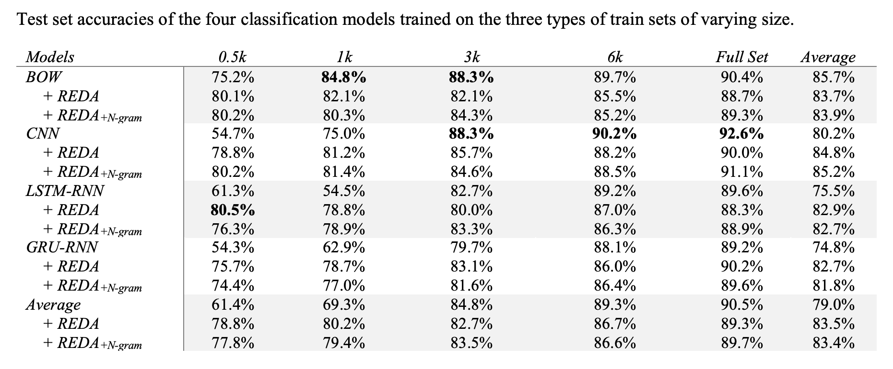
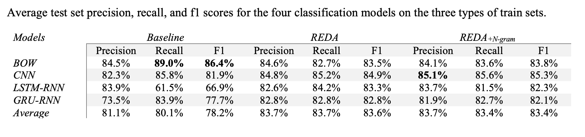
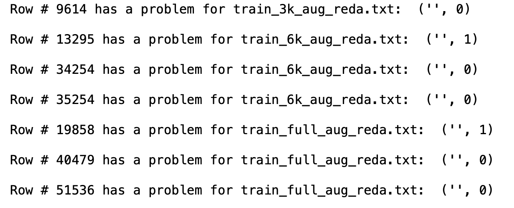

## Description

This folder stores code, data, and experimental results for additional tests on Chinese sentiment analysis where four supervised classification models (`ERNIE-Gram` was excluded here because it was expensive to train and may not reveal anything interesting) are trained on three types of train sets of varying sizes: un-augmented train sets, train sets augmented by the `reda` program, and train sets augmented by the `reda` program combined with a `ngram` model. 

The [Chinese Sentiment Corpus](https://ccc.inaoep.mx/~villasen/bib/An%20empirical%20study%20of%20sentiment%20analysis%20for%20chinese%20documents.pdf) is used here for text augmentation and model training. My [text-classification-explained](https://github.com/jaaack-wang/text-classification-explained) repository explains how the dataset can be obtained, which also provides the four models for training Chinese sentiment classifier as in the `paddle_models` folder.

I reused the code for my preprint to augment Chinese. The whole text augmentation process is recorded in the `Aug_Texts` folder. 

## Basic statistics about the dataset

- For the train, dev, and test set.

| Dataset | Total | Positive| Negative | 
| :---: | :---: | :---: | :---: |
| Train | 9,600 | 4,798 | 4,802 | 
| Dev | 1,200 | 590 | 610 | 
| Test | 1,200 | 602 | 598 | 

- For the augmented train sets.

| Base | 0.5k | 1k | 3k| 6k| full (9k)|
| :---: | :---: | :---: | :---: | :---: | :---: |
| + REDA | 3,997 | 7,992 | 23,990 | 47,991 | 57,573 |
| + REDA + Ngram | 3,991 | 7,980 | 23,970 | 47,953 | 57,520 |

## Results

I only trained four classifcation models (BoW, CNN, LSTM-RNN, GRU-RNN), the details of which can be seen in the `Training.ipynb` file. As the data size is small, so you can re-run the script on your own computer for few hours. The full statistics can be found in the `ModelPerformances.xlsx` file.

- Test set accuracies of the four classification models trained on the three types of train sets of varying size.

- Average test set precision, recall, and f1 scores for the four classification models on the three types of train sets.

## Findings

- Random text editing brings a very significant gain for sentiment (especially the CNN, and the two RNN models) classifier when the original train set size is only 500. This gain averages up the overall performances of the classification models trained on the augmented train sets. However, with the original train set becoming larger, such gain decline dramatically. Even for the CNN and RNN models, the augmented train sets almost stop boosting the trained models' performance when the train set size is 6k or larger.
- Again, adding a ngram language to the `reda` program does not make a big difference and overall is detrimental to the models' performances. This is in line with the observation made in my preprint. 
- `reda` program may bring boost the performances of the trained models if initialized well (which is not the focus of mine), as shown in [the EDA paper](https://arxiv.org/abs/1901.11196). However, this paper only trained CNN and RNN models, which as shown here, benefitted a lot from text augmentation when the train set is small. If other models, such as the BoW model, were also trained on the `EDA`-augmented train sets, the authors may have different observations. This shows the importance of training more models so that more well-rounded findings can be made. 

## Notes

- There were minor problems identified during model training: there were a few training examples from the augmented train sets had empty text, which renderred an error when running the RNN models. The statistics reported above were adjusted accordingly. These file include:

