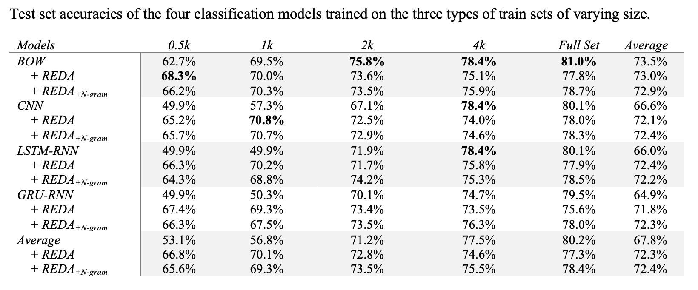
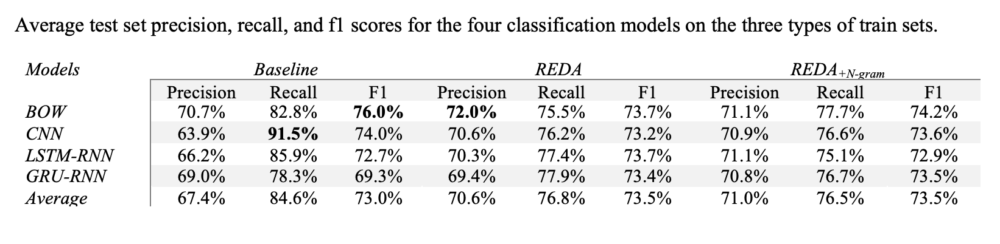

## Description

This folder stores code, data, and experimental results for additional tests on English sentiment analysis where four supervised classification models (`ERNIE-Gram` was excluded here because it was expensive to train and may not reveal anything interesting) are trained on three types of train sets of varying sizes: un-augmented train sets, train sets augmented by the `reda` program, and train sets augmented by the `reda` program combined with a `ngram` model. 

The [SST-2](https://github.com/YJiangcm/SST-2-sentiment-analysis/tree/master/data) is used here for text augmentation and model training. My [text-classification-explained](https://github.com/jaaack-wang/text-classification-explained) repository explains how the dataset can be obtained, which also provides the four models for training Chinese sentiment classifier as in the `paddle_models` folder.

The `Ngrams_Aug_Texts` folder provides details on how the n-gram language model for English is trained and how the augmented train sets are built.

## Basic statistics about the dataset

- For the train, dev, and test set.

| Dataset | Total | Positive| Negative | 
| :---: | :---: | :---: | :---: |
| Train | 6,920 | 3,610 | 3,310 | 
| Dev | 872 | 444 | 428 | 
| Test | 1,821 | 909 | 912 | 

- For the augmented train sets.

| Base | 0.5k | 1k | 2k| 4k| full set |
| :---: | :---: | :---: | :---: | :---: | :---: |
| + REDA | 3,953 | 7,899 | 15,780 | 31,585 | 40,883 |
| + REDA + Ngram | 3,936 | 7,859 | 15,702 | 31,436 | 40,713 |

## Results

I only trained four classifcation models (BoW, CNN, LSTM-RNN, GRU-RNN), the details of which can be seen in the `Training.ipynb` file. As the data size is small, so you can re-run the script on your own computer for few hours. The full statistics can be found in the `ModelPerformances.xlsx` file.

- Test set accuracies of the four classification models trained on the three types of train sets of varying size.

- Average test set precision, recall, and f1 scores for the four classification models on the three types of train sets.

## Findings

If you happen to see the tests on Chinese sentiment analysis, you will find that the conclusions are nearly the same. The only thing I changed is: 6k --> 4k.

- Random text editing brings a very significant gain for sentiment (especially the CNN, and the two RNN models) classifier when the original train set size is only 500. This gain averages up the overall performances of the classification models trained on the augmented train sets. However, with the original train set becoming larger, such gain decline dramatically. Even for the CNN and RNN models, the augmented train sets almost stop boosting the trained models' performance when the train set size is 4k or larger.
- Again, adding a ngram language to the `reda` program does not make a big difference and overall is detrimental to the models' performances. This is in line with the observation made in my preprint. 
- `reda` program may bring boost the performances of the trained models if initialized well (which is not the focus of mine), as shown in [the EDA paper](https://arxiv.org/abs/1901.11196). However, this paper only trained CNN and RNN models, which as shown here, benefitted a lot from text augmentation when the train set is small. If other models, such as the BoW model, were also trained on the `EDA`-augmented train sets, the authors may have different observations. This shows the importance of training more models so that more well-rounded findings can be made. 
